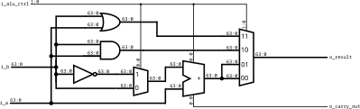

# Av2 - 2° Semestre de 2024

Avaliação 2 - Elementos de Sistemas

| Pontos HW | Pontos SW |
|:---------:|:---------:|
| 40        | 10        |

- Avaliação individual.
- 120 min total.
- Ficar no blackboard durante a prova.
- Fazer commit ao final de cada questão.
- Lembre de dar **push** ao final.

## 1. Lógica combinacional - jokenpô

| Pontos HW | Pontos SW |
|:---------:|:---------:|
| 10        | 0         |

Queremos fazer um código VHDL para o jogo **jokenpô** (Pedra, papel e tesoura).

Lembrando que as regras são:
		
No Janken-pon, os jogadores devem simultaneamente esticar a mão, na qual cada um formou um símbolo (que significa pedra, papel ou tesoura). Então, os jogadores comparam os símbolos para decidir quem ganhou, da seguinte forma:

- Pedra ganha da tesoura (amassando-a ou quebrando-a).
- Tesoura ganha do papel (cortando-o).
- Papel ganha da pedra (embrulhando-a).

A pedra é simbolizada por um punho fechado; a tesoura, por dois dedos esticados; e o papel, pela mão aberta. Caso dois jogadores façam o mesmo gesto, ocorre um empate, e geralmente se joga de novo até desempatar.

### Implementação

Considere que temos dois jogadores _x_ e _y_ representados como sinais de 2 bits, sendo que

- a combinação "00" representa pedra
- a combinação "01" representa papel
- a combinação "10" representa tesoura

A saída `ganhador` também de 2 bits deve indicar "10" se  _x_ ganho, "01" se _y_ ganhou ou "11" se houver empate.

Implemente a saída `ganhador` no arquivo `src/jokenpo.vhd`.

**Lembre de testar com `pytest -k jokenpo**

#### Rubrica para avaliação:

| Pontos HW | Descritivo                                |
|-----------|-------------------------------------------|
| 10         | Implementação correta |
| ?         | Implementações incorretas serão analisadas caso a caso|

## 2. Lógica sequencial 

| Pontos HW | Pontos SW |
|:---------:|:---------:|
| 10        | 0         |

Considere o código vhdl a seguir:

``
library IEEE; 
use IEEE.STD_LOGIC_1164.ALL;

entity blocoX is
	port ( 
		CLOCK : in  std_logic;
		SW        : in  std_logic_vector(9 downto 0);
		HEX0     : out std_logic_vector(6 downto 0);
        );
end entity;

architecture rtl of blocoX is
            SIGNAL y: std_logic_vector(6 downto 0) := "0000000";
begin
            process(CLOCK)
            begin
            	if rising_edge(CLOCK) then
                	if (SW(0) = '1') then
                    	if (y =  "0000000") then
                        	y <=  "0000001";
                        elsif (y =  "0000001") then
                        	y <=  "0000010";
                        elsif (y =  "0000010") then
                        	y <=  "0000100";
                        elsif (y =  "0000100") then
                        	y <=  "0001000";
                        elsif (y =  "0001000") then
                        	y <=  "0010000";
                        elsif (y =  "0010000") then
                        	y <=  "0100000";
                        elsif (y =  "0100000") then
                        	y <=  "1000000";
                        else
                        	y <=  "0000000";
                        end if;
                    end if;
                end if;
            end process;
			HEX0 <= y;
end;
``

### Questões:

1. Qual a saída para as próximas 5 bordas de subida, considerando que SW(0) esteja em '1' nas três primeiras bordas e em '0' nas duas últimas? Responda no arquivo Q2.txt.

#### Rubrica para avaliação:

| Pontos HW | Descritivo                                 |
|-----------|--------------------------------------------|
| 2         | Para a saída certa em cada instante de tempo |

## 3. Cadeado eletrônico

| Pontos HW | Pontos SW |
|:---------:|:---------:|
| 20        | 0         |

Queremos implementar um cadeado eletrônico que possua o seguinte funcionamento:

- sincronizado a cada borda de subida do clock
- se o KEY(0) for '1', as posições das chaves SW será salva no sinal senha
- se o KEY(1) for '1', as posições das chaves SW deve ser comparada com o sinal senha: se forem iguais todos os LEDs devem acender e deverá aparecer "YES" nos HEX2, HEX1 e HEX0; se forem diferentes tudo deve permanecer desligado.

### Implementação/questão:

Implemente o código no arquivo `src/cadeado.vhd`.

**Lembre de testar com `pytest -k cadeado**

#### Rubrica para avaliação:

| Pontos HW | Descritivo                                 |
|-----------|--------------------------------------------|
| 10         | Implementação da gravação e teste da senha |
| 10         | Funcionamento síncrono        |

## 4. ALU modificada

| Pontos HW    | Pontos SW      |
| :--------:   | :--:           |
|    0         |  10            |

Queremos escrever o arquivo de testes para a ALU simplificada mostrada na figura.

{width=300}

Escreva as saídas esperadas em o_result para as condições indicadas na tabela:

| i_a  | i_b   | i_alu_ctrl   | o_result   |
| :--------:   | :--:           |  :--:           |  :--:           |
|    x"0000000000000123"         |  x"0000000000000123" | "10" |             |
|    x"0000000000000123"         |  x"0000000000000123" | "11" |             |
|    x"0000000000000123"         |  x"0000000000000123" | "01" |             |
|    x"0000000000000123"         |  x"0000000000000123" | "00" |             |

Qual seria a o_carry_out esperado para o último caso?

### Implementação

Responda no arquivo `src/resultados.txt`.

#### Rubrica para avaliação:

| Pontos SW | Descritivo                                           |
|-----------|------------------------------------------------------|
| 2        | Por cada item |

